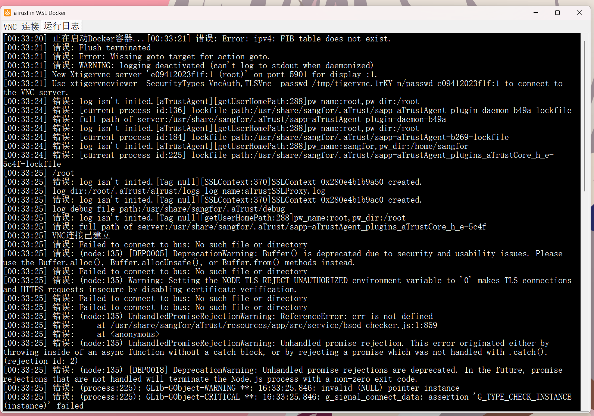
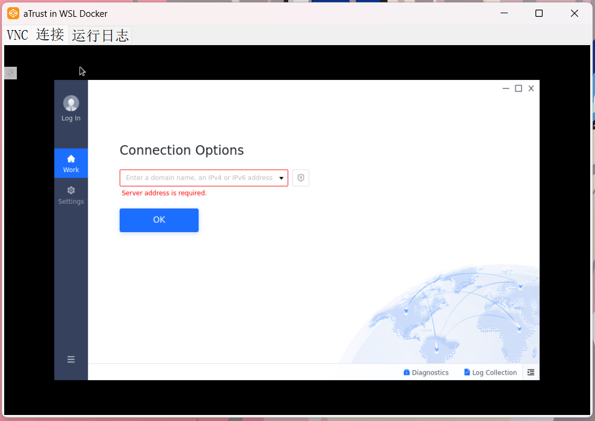

# aTrustOnWsl

一个在 Windows 上通过 WSL Docker 运行 aTrust 客户端的图形界面应用程序。

## 项目介绍

aTrustOnWsl 是一个 Windows 窗体应用程序，它通过 WSL (Windows Subsystem for Linux) 中的 Docker 容器运行 aTrust 安全客户端，并提供图形界面进行访问。该程序自动启动 aTrust Docker 容器，并通过 VNC 连接显示容器中的图形界面，使用户能够在 Windows 环境中无缝使用 aTrust 客户端。

主要功能：
- 自动启动 aTrust Docker 容器
- 通过 VNC 连接显示容器中的图形界面
- 最小化到系统托盘功能
- 实时显示容器运行日志

## 第三方依赖

本项目使用了以下第三方库和工具：

1. **VncSharp** - 用于在 WinForms 应用中显示 VNC 连接
   - 版本: 1.0.7.0
   - 项目地址: [https://github.com/humphd/VncSharp](https://github.com/humphd/VncSharp)

2. **Docker 镜像** - aTrust 客户端 Docker 镜像
   - 镜像: hagb/docker-atrust
   - 该项目将 aTrust 客户端封装在 Docker 容器中，以便在 WSL 环境中运行

3. **WSL (Windows Subsystem for Linux)** - 在 Windows 上运行 Linux 环境以支持 Docker

## 运行效果

主界面展示：

日志界面展示：

## 使用说明

1. 确保已安装 WSL 并配置好 Docker 环境
2. 运行程序后会自动启动 aTrust Docker 容器
3. 程序通过 VNC 连接到容器中的图形界面
4. 可以通过最小化到托盘来隐藏程序窗口
5. 在托盘图标上右键可选择还原或退出程序

## 注意事项

- 首次运行可能需要下载 hagb/docker-atrust 镜像
- 确保 35901、31080、8888、54631 等端口未被占用